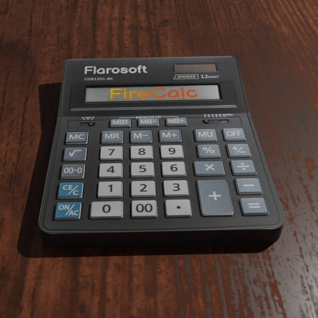
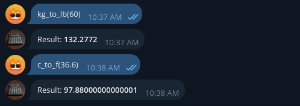
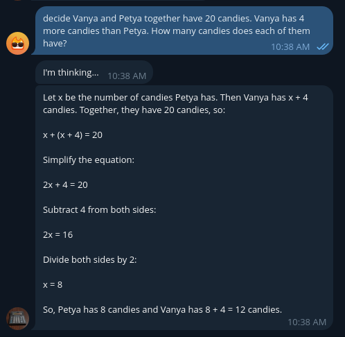

# FireCalc

[**FireCalc**](https://t.me/firecalctg_bot) is a free Telegram bot developed in Python by [**Flarosoft**](https://t.me/flarosoftdev) for solving mathematical expressions, equations, problems and much more.

## Functionality

This bot provides a huge functionality:

- Solving mathematical expressions
- Solving mathematical equations
- Solving mathematical text problems
- Conversion
  - Temperatures (°C, °F, °K)
  - Masses (kg, lb)
- Generating random numbers
- Graph plotting
- Showing the current date
- Executing functions
  - Factorials
  - Logarithms
  - Exponentiation
  - And many others

*\* You can read about the full functionality in the [**article**](https://telegra.ph/FireCalc--your-personal-math-assistant-in-Telegram-03-17).*

## Screenshots

### FireCalc solves a mathematical expression by performing two functions

### FireCalc solves math equation

### FireCalc converts kilograms to pounds and Celsius to Fahrenheit

### FireCalc solves math word problems, providing step-by-step explanations.

## Contacts
- Developer: **Flarosoft**
- Email: [flarosoft.dev@gmail.com](mailto:flarosoft.dev@gmail.com)
- Developer's Telegram channel: [@flarosoftdev](https://t.me/flarosoftdev)
- Archive with Telegram bots from Flarosoft: [@flarosoftbots](https://t.me/flarosoftbots)
- GitHub: [Flarosoft Development](https://github.com/flarosoftdev)
- Developer's website: [flarosoft.pages.dev](https://flarosoft.pages.dev)
